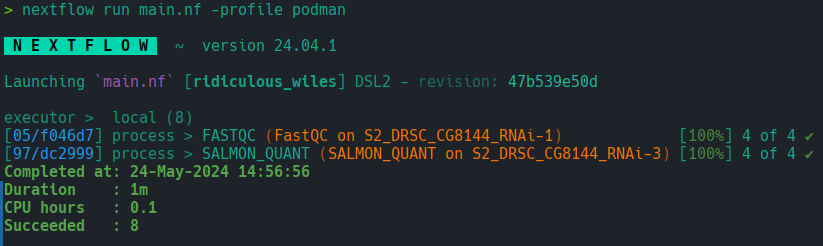

# minimal_nextflow_samplesheet_example
A minimal RNAseq workflow, written in Nextflow, an example of using a 
samplesheet for metadata.

This is intended to demonstrate reading from metadata and some basic 
functionality of Nextflow.

## Requirements

To execute the wokflow, you need:
1. A container runtime, one of:
   - Docker
   - Apptainer
   - Podman
2. Nextflow and its dependencies.
   - https://www.nextflow.io/docs/latest/install.html
3. Ability to run shell scripts and general comfortability on the command line.

**Note:** The scripts to download the test data and the reference transcriptome
require apptainer, you can also use Podman or Docker with modification.

## Workflow Steps

1. [Fastqc](https://github.com/s-andrews/FastQC)
2. [Salmon](https://github.com/COMBINE-lab/salmon)

**Note:** These steps run in parallel.

## Getting Started

1. Clone the github repository.
2. Run the `download_ref_salmon_index.sh` script to get the *D. melanogaster* transcriptome and index it with Salmon.
   - **Note:** This script requires apptainer, you can also use podman or docker with modification
3. Run the `download_test_data.sh` script to download the test data from SRA.
   - **Note:** This script requires apptainer, you can also use podman or docker with modification
4. Run the workflow with `nextflow run main.nf -profile {docker|podman|apptainer}`

## Successful Run

## References

This example uses data from:

Huber W, Reyes A (2024). pasilla: Data package with per-exon and per-gene read
counts of RNA-seq samples of Pasilla knock-down by Brooks et al.,
Genome Research 2011.. R package version 1.32.0. 

Brooks AN, Yang L, Duff MO, Hansen KD et al. Conservation of an RNA regulatory
map between Drosophila and mammals. Genome Res 2011 Feb;21(2):193-202. PMID: 20921232

Brooks AN, Duff MO, May G, Yang L et al. Regulation of alternative splicing in
Drosophila by 56 RNA binding proteins. Genome Res 2015 Nov;25(11):1771-80. PMID: 26294686

GEO: GSE18508 
SRA: SRP001537